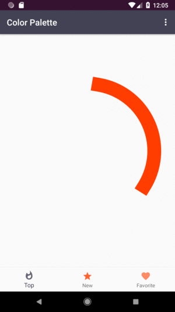

# Color Palette

## Description

The app displays two types of a list with top and new palettes to choose from and you can save them in a favorite list. When the user clicks on one of the palettes, he will receive more detailed information about it.

## Intended User

The app helps mobile app developers and designers to choose a palette or a good color combination. It is a source of inspiration to make web-pages and mobile apps more colorful, beautiful and more appealing to the user.

## Features

- Displays color palettes
- Gives details about palettes, such as color’s hex code, original web-page’s link
- Shares palettes’ detail data trough SMS, email, etc
- Saves them to a favorite list
- Displays a widget with color palettes

## Screenshots

